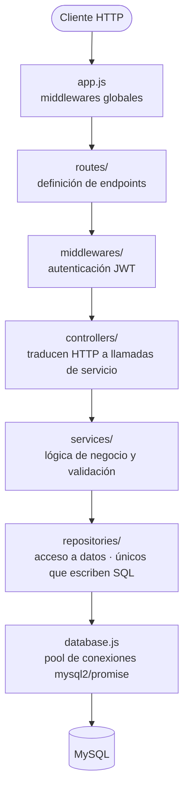
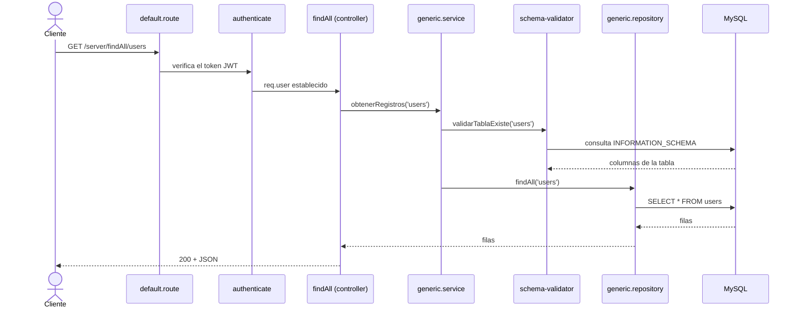
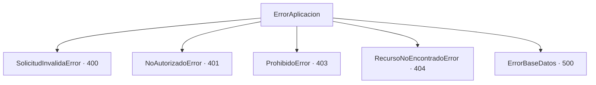

# Wiki — API-NODE-MYSQL

Documentación detallada del proyecto. El [README](./README.md) cubre la
instalación; este archivo cubre el "cómo funciona", las buenas prácticas y
las pruebas.

## 1. Descripción

API REST en Node.js + Express que expone un **CRUD genérico sobre MySQL**: la
tabla a operar se recibe como parámetro de ruta (`/:tabla`), de modo que un
mismo conjunto de endpoints sirve para cualquier tabla del esquema. El acceso
está protegido con autenticación **JWT**.

Para que el CRUD genérico sea seguro, cada tabla y columna recibidas se
validan contra la estructura real de la base de datos antes de ejecutar
cualquier consulta (ver sección 7).

## 2. Arquitectura

El proyecto sigue una **arquitectura en capas** (Clean Architecture). Cada
capa solo depende de la que tiene inmediatamente debajo, y las dependencias
apuntan siempre hacia adentro: una capa interna nunca conoce a una externa.



`errors/` y `utils/` (logger, asyncHandler) son **transversales**: cualquier
capa puede usarlos.

### Flujo de una petición

Ejemplo de `GET /server/findAll/users`:



Cualquier error lanzado en el camino se propaga al middleware
`error-handler`, que construye la respuesta de error.

## 3. Estructura de carpetas

```
.
├── app.js                      Punto de entrada de Express
├── config.js                   Configuración desde variables de entorno
├── Dockerfile                  Imagen del backend (multi-etapa)
├── docker-compose.yml          Orquestación de BD + API
├── db/sql/
│   ├── create_schema.sql       Esquema inicial (tabla users)
│   └── data.sql                Datos de ejemplo
└── src/
    ├── database.js             Pool de conexiones mysql2/promise
    ├── routes/                 auth.route.js, default.route.js
    ├── middlewares/            authenticate, error-handler, not-found
    ├── controllers/            auth.controller, default.controller, msgController
    ├── services/               generic.service, schema-validator.service
    ├── repositories/           generic.repository, schema.repository, user.repository
    ├── errors/                 Jerarquía de errores de dominio
    └── utils/                  logger, async-handler
```

## 4. Las capas en detalle

### Routes (`src/routes/`)

Declaran los endpoints y el orden de middlewares. No contienen lógica.

- `auth.route.js` — `POST /auth/login`
- `default.route.js` — el CRUD genérico; cada ruta pasa primero por el
  middleware `authenticate`.

### Middlewares (`src/middlewares/`)

- `authenticate.middleware.js` — extrae el token `Bearer` del header
  `Authorization` y lo verifica. Deja los datos del usuario en `req.user` o
  corta la petición con `NoAutorizadoError` / `ProhibidoError`.
- `error-handler.middleware.js` — middleware central de errores. Convierte
  cualquier error en una respuesta JSON uniforme y nunca expone detalles
  internos (stack, SQL) al cliente.
- `not-found.middleware.js` — responde las rutas no registradas con
  `RecursoNoEncontradoError`.

### Controllers (`src/controllers/`)

Capa fina entre HTTP y los servicios. Cada handler se envuelve en
`asyncHandler` para que los errores se propaguen sin `try/catch` repetido.

- `auth.controller.js` — `login`.
- `default.controller.js` — `create`, `findAll`, `searchBy`, `update`,
  `delete`.
- `msgController.js` — mensajes de respuesta para las operaciones exitosas.

### Services (`src/services/`)

Lógica de negocio y validación. No conocen HTTP.

- `schema-validator.service.js` — valida tablas y columnas contra el
  catálogo de la base de datos, con caché en memoria (TTL de 60 s).
- `generic.service.js` — orquesta: valida con el `schema-validator` y luego
  delega en el repositorio.

### Repositories (`src/repositories/`)

Única capa que escribe SQL. Envuelven los errores de `mysql2` en errores de
dominio (`ErrorBaseDatos`).

- `generic.repository.js` — CRUD genérico parametrizado.
- `schema.repository.js` — consulta a `INFORMATION_SCHEMA`.
- `user.repository.js` — búsqueda de usuarios para el login.

### Transversales

- `errors/index.js` — jerarquía de errores de dominio.
- `utils/logger.js` — logging centralizado con niveles y marca de tiempo.
- `utils/async-handler.js` — propaga rechazos de promesa al middleware de
  errores.
- `database.js` — pool de conexiones reutilizables a MySQL.

## 5. Modelo de datos

Tabla `users` (definida en `db/sql/create_schema.sql`):

```sql
CREATE TABLE users (
  id         INT AUTO_INCREMENT PRIMARY KEY,
  name       VARCHAR(100) NOT NULL,
  email      VARCHAR(150) NOT NULL UNIQUE,
  pass       VARCHAR(255) NOT NULL,   -- hash bcrypt
  created_at TIMESTAMP NOT NULL DEFAULT CURRENT_TIMESTAMP,
  updated_at TIMESTAMP NOT NULL DEFAULT CURRENT_TIMESTAMP
                                      ON UPDATE CURRENT_TIMESTAMP
);
```

El CRUD genérico opera sobre cualquier tabla del esquema, no solo `users`.

## 6. Endpoints

Todas las respuestas son JSON. Los endpoints de `/server` requieren el header
`Authorization: Bearer <token>`.

### POST /auth/login

Autentica un usuario y devuelve un token JWT.

Cuerpo:

```json
{ "user": "weizman@example.com", "pass": "Colombia2020*" }
```

Respuesta `200`:

```json
{ "token": "eyJhbGciOiJIUzI1NiIsInR5cCI6IkpXVCJ9..." }
```

Errores: `400` si falta el usuario o la contraseña; `401` si las
credenciales son inválidas.

### PUT /auth/reset-password

Restablece la contraseña de un usuario. **Requiere token JWT** (header
`Authorization: Bearer <token>`): un endpoint de restablecimiento abierto
permitiría que cualquiera secuestrara una cuenta.

Cuerpo:

```json
{ "email": "carlos@example.com", "newPass": "NuevaClave123*" }
```

Respuesta `200`:

```json
{ "msg": "Contraseña actualizada correctamente" }
```

Errores: `400` si falta algún campo; `404` si el email no existe.

### POST /server/create/:tabla

Inserta un registro. El cuerpo es el objeto a insertar.

```json
POST /server/create/users
{ "name": "Nuevo Usuario", "email": "nuevo@example.com", "pass": "Clave123*" }
```

Respuesta `200`: `{ "msg": { ... } }`

### GET /server/findAll/:tabla

Lista todos los registros de la tabla.

```
GET /server/findAll/users
```

Respuesta `200`: arreglo de registros.

```json
[
  { "id": 1, "name": "Weizman Fabian", "email": "weizman@example.com", "...": "..." }
]
```

### GET /server/searchBy/:tabla/:name/:value

Busca registros donde la columna `:name` sea igual a `:value`.

```
GET /server/searchBy/users/email/ana@example.com
```

Respuesta `200`: `{ "rows": [ ... ], "msg": { ... } }`

### PUT /server/update/:tabla/:name/:value

Actualiza los registros donde `:name` sea igual a `:value`. El cuerpo lleva
los nuevos valores.

```json
PUT /server/update/users/id/2
{ "name": "Ana María Gómez" }
```

Respuesta `200`: `{ "msg": { ... } }`

### DELETE /server/delete/:tabla/:name/:value

Elimina los registros donde `:name` sea igual a `:value`.

```
DELETE /server/delete/users/id/4
```

Respuesta `200`: `{ "msg": { ... } }`

## 7. Autenticación y seguridad

- **JWT** — `login` devuelve un token firmado con `JWT_SECRET`. El payload
  lleva solo los datos públicos del usuario (id, nombre, email); nunca la
  contraseña. El middleware `authenticate` lo verifica en cada petición
  protegida.
- **Contraseñas** — se almacenan como hash **bcrypt**; el login compara con
  `bcrypt.compare`. El mensaje de error es genérico ("Credenciales
  inválidas") para no facilitar la enumeración de usuarios.
- **Prevención de inyección SQL** — los repositorios escapan los
  identificadores (tabla, columna) con el placeholder `??` y los valores con
  `?`; nunca se concatena entrada del usuario en el SQL.
- **Validación por introspección del catálogo** — antes de tocar la base de
  datos, el `schema-validator.service` confirma contra
  `INFORMATION_SCHEMA.COLUMNS` que la tabla y las columnas existen. Esto
  conserva el CRUD genérico (cualquier tabla) sin riesgo de operar sobre
  identificadores inexistentes.
- **Configuración** — credenciales y secretos se leen de variables de
  entorno; no hay valores sensibles en el código.

## 8. Manejo de errores

Todos los errores de dominio heredan de `ErrorAplicacion` y producen una
respuesta JSON uniforme:

```json
{ "error": { "codigo": "RECURSO_NO_ENCONTRADO", "mensaje": "La tabla 'x' no existe" } }
```



| Error | HTTP | Código | Cuándo ocurre |
|-------|------|--------|---------------|
| `SolicitudInvalidaError` | 400 | `SOLICITUD_INVALIDA` | Cuerpo vacío o columnas inexistentes |
| `NoAutorizadoError` | 401 | `NO_AUTORIZADO` | Token ausente o credenciales inválidas |
| `ProhibidoError` | 403 | `PROHIBIDO` | Token inválido o expirado |
| `RecursoNoEncontradoError` | 404 | `RECURSO_NO_ENCONTRADO` | Tabla o ruta inexistente |
| `ErrorBaseDatos` | 500 | `ERROR_BASE_DATOS` | Falla al ejecutar una consulta |

Los errores no controlados se registran con su stack en el servidor y
responden `500` con un mensaje genérico, sin exponer detalles internos.

## 9. Buenas prácticas aplicadas

El refactor del proyecto siguió estándares de Clean Code, SOLID, SonarQube y
Conventional Commits.

### Clean Code

- Nombres que revelan intención; los métodos empiezan por un verbo
  (`obtenerRegistros`, `validarCuerpo`, `generarToken`).
- Funciones pequeñas que hacen una sola cosa; controladores delgados.
- Guard clauses y retornos tempranos en lugar de condicionales anidados.
- Eliminación de todo el código muerto y las dependencias sin uso.
- Código autoexplicativo; comentarios solo para el "por qué".

### SOLID

| Principio | Cómo se aplica |
|-----------|----------------|
| Responsabilidad única | Cada capa tiene una sola razón de cambio: controllers (HTTP), services (negocio), repositories (datos). |
| Abierto/Cerrado | Agregar un nuevo tipo de error es crear una clase nueva; el middleware de errores no se modifica. |
| Sustitución de Liskov | Toda subclase de `ErrorAplicacion` honra el contrato de la clase base. |
| Segregación de interfaces | Módulos pequeños y enfocados (`logger`, `asyncHandler`, `schema-validator`). |
| Inversión de dependencias | El flujo apunta hacia adentro: controllers → services → repositories. La configuración se inyecta vía variables de entorno. |

### SonarQube / quality gates

- Complejidad cognitiva baja gracias a controladores delgados y guard clauses.
- Sin inyección SQL: consultas parametrizadas + validación por catálogo.
- Sin credenciales ni secretos hardcodeados (variables de entorno).
- Sin contraseñas ni datos sensibles en los logs.
- Logging centralizado en un módulo, sin `console.log` disperso.
- Manejo de errores sin bloques `catch` vacíos.
- Números y cadenas significativas extraídos a constantes con nombre.

### Git — Conventional Commits

Historial con commits atómicos y mensajes en español siguiendo la
especificación: `feat`, `fix`, `refactor`, `chore`, `build`, `docs`.

### Docker

Imagen multi-etapa, ejecución con usuario sin privilegios y `.dockerignore`
para mantener la imagen pequeña y segura.

## 10. Pruebas

Mientras no haya pruebas automatizadas, la API se prueba de forma manual:

- `testing/peticion.http` — peticiones de ejemplo (extensión REST Client de
  VS Code).
- `JWTMYSQL.postman_collection.json` — colección de Postman.

Secuencia de prueba típica (PowerShell):

```powershell
# Obtener token
$r = Invoke-RestMethod -Uri "http://localhost:5000/auth/login" -Method Post `
  -ContentType "application/json" `
  -Body '{"user":"weizman@example.com","pass":"Colombia2020*"}'
$h = @{ Authorization = "Bearer $($r.token)" }

# Consultar
Invoke-RestMethod -Uri "http://localhost:5000/server/findAll/users" -Headers $h
```

Casos a cubrir: camino feliz del CRUD, token ausente (`401`), token inválido
(`403`), tabla inexistente (`404`) y columnas inválidas (`400`).

## 11. Decisiones de diseño y limitaciones conocidas

- **Validación por metadata en vez de lista blanca** — se eligió validar
  contra `INFORMATION_SCHEMA` para conservar el CRUD 100% genérico sin tener
  que mantener una lista de tablas permitidas.
- **`mysql2/promise` con pool** — reemplazó a `express-myconnection` (sin
  mantenimiento) y habilitó `async/await` y el manejo de errores centralizado.
- **CommonJS** — se conservó el sistema de módulos original; no se migró a ESM.
- **Respuestas de éxito con objeto `msg`** — `create`, `update`, `delete` y
  `searchBy` devuelven un objeto `msg` heredado del frontend original
  (configuración de toasts SweetAlert). Se mantiene para no romper el
  contrato existente.
- **Hash de contraseñas solo en datos semilla** — el CRUD genérico no conoce
  el concepto "contraseña": un usuario creado vía `POST /server/create/users`
  guarda la contraseña en texto plano y no podrá iniciar sesión. Para darle
  una contraseña usable basta con llamar a `PUT /auth/reset-password`, que sí
  la almacena como hash bcrypt.
